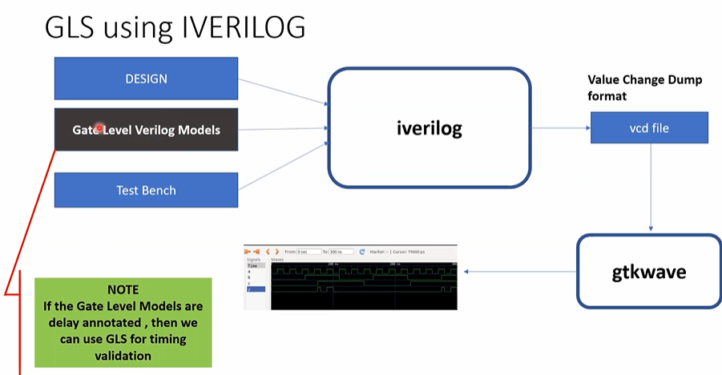

**4Bit\_ring\_counter\_iiitb**

**INTRODUCTION**

This project simulates the design of a 4-bit ring counter using verilog HDL. A ring counter works in a similar way as a shift register. The only difference is that the output of the last flip-flop is connected to the input of the first flip-flop. In this way, the counter forms a ring and hence is called ring counter. In this design, four D-Flip-flops are used with clock and ori(override input) signals.

**BLOCK DIAGRAM**

  
 

The above figure is the block diagram of a 4-bit ring counter. The figure shows four D flip flop connected with a clock and an ORI signal. The design uses an active high ORI signal which sets the first flip flop to '1' and the other three flip flops to '0' when ORI is high. The circuit uses a positive edge triggered clock.

**WORKING**

The counter is set to an initial state of *'1000'* by the ORI signal. In the next positive edge of the clock, the values of the flip flops are shifted right and the output of last flip flop is sent to the first one. So, the next state becomes *'0100'*. Similarly after next positive edge of clock, the state of the counter becomes *'0010'*. This continues until the ORI is again high which will set the counter back to *'1000'*.

**RTL SIMULATION**

In the above waveform, ORI signal sets the counter to '1000' and then the counter runs in a loop with three states until ORI is high again.

**TOOLS USED**

**IVERILOG**

Icarus Verilog is a Verilog simulation and synthesis tool.
To install iverilog, type the following command in the terminal:

$ sudo apt install iverilog 

**GTKWAVE**
GTKWave is a VCD waveform viewer based on the GTK library. This viewer support VCD and LXT formats for signal dumps.

$ sudo apt install gtkwave 

**YOSYS**
Yosys is a framework for Verilog RTL synthesis. It currently has extensive Verilog-2005 support and provides a basic set of synthesis algorithms for various application domains.

Synthesis transforms the simple RTL design into a gate-level netlist with all the constraints as specified by the designer. In simple language, Synthesis is a process that converts the abstract form of design to a properly implemented chip in terms of logic gates.

Synthesis takes place in multiple steps:

-Converting RTL into simple logic gates.
-Mapping those gates to actual technology-dependent logic gates available in the technology libraries.
-Optimizing the mapped netlist keeping the constraints set by the designer intact.

Yosys can be adapted to perform any synthesis job by combining the existing passes (algorithms) using synthesis scripts and adding additional passes as needed by extending the yosys C++ code base.

Yosys is free software licensed under the ISC license (a GPL compatible license that is similar in terms to the MIT license or the 2-clause BSD license).
To install Yosys in Ubuntu, follow the following steps:

$ sudo apt-get install build-essential clang bison flex \ libreadline-dev gawk tcl-dev libffi-dev git \ graphviz xdot pkg-config python3 libboost-system-dev \ libboost-python-dev libboost-filesystem-dev zlib1g-dev

To configure the build system to use a specific compiler, use one of the following command:

$ make config-clang

$ make config-gcc

To build Yosys simply type 'make' in this directory.

$ make

$ sudo make install

$ make test

  
 

 
 
 

  
 

**GTL- Gate Level Simulation**

GLS is generating the simulation output by running test bench with netlist file generated from synthesis as design under test. Netlist is logically same as RTL code, therefore, same test bench can be used for it.
Below picture gives an insight of the procedure. Here while using iverilog, you also include gate level verilog models to generate GLS simulation.

  

  
 

**Docker Installation**

$ sudo apt-get remove docker docker-engine docker.io containerd runc (removes older version of docker if installed)

$ sudo apt-get update

$ sudo apt-get install \
    ca-certificates \
    curl \
    gnupg \
    lsb-release
    
$ sudo mkdir -p /etc/apt/keyrings

$ curl -fsSL https://download.docker.com/linux/ubuntu/gpg | sudo gpg --dearmor -o /etc/apt/keyrings/docker.gpg

$ echo \
  "deb [arch=$(dpkg --print-architecture) signed-by=/etc/apt/keyrings/docker.gpg] https://download.docker.com/linux/ubuntu \
  $(lsb_release -cs) stable" | sudo tee /etc/apt/sources.list.d/docker.list > /dev/null
  
$ sudo apt-get update

$ sudo apt-get install docker-ce docker-ce-cli containerd.io docker-compose-plugin

$ apt-cache madison docker-ce (copy the version string you want to install)

$ sudo apt-get install docker-ce=<VERSION_STRING> docker-ce-cli=<VERSION_STRING> containerd.io docker-compose-plugin (paste the version string copies in place of <VERSION_STRING>)

$ sudo docker run hello-world (If the docker is successfully installed u will get a success message here)

**Openlane Installation**

$ git clone https://github.com/The-OpenROAD-Project/OpenLane.git

$ cd OpenLane/

$ make

$ make test

**Magic Installation**

For Magic to be installed and work properly the following softwares have to be installed first:

**Installing csh**
$ sudo apt-get install csh

**Installing x11/xorg**
$ sudo apt-get install x11

$ sudo apt-get install xorg

$ sudo apt-get install xorg openbox

**Installing GCC**
$ sudo apt-get install gcc

**Installing build-essential**
$ sudo apt-get install build-essential

**Installing OpenGL**
$ sudo apt-get install freeglut3-dev

**Installing tcl/tk**
$ sudo apt-get install tcl-dev tk-dev

**Installing magic**
After all the softwares are installed, run the following commands for installing magic:

$ git clone https://github.com/RTimothyEdwards/magic

$ cd magic

$ ./configure

$ make

$ make install

**Klayout Installation**
$ sudo apt-get install klayout

**ngspice Installation**
$ sudo apt-get install ngspice

**PRE SYNTHESIS**
To clone the repository, download the netlist files and simulate the results, Enter the following commands in your terminal:

 $ git clone https://github.com/DantuNandiniDevi/iiitb_freqdiv 

 $ cd iiitb_freqdiv 
 
 $ iverilog -o iiitb_freqdiv_out.out iiitb_freqdiv.v iiitb_freqdiv_tb.v
 
 $ ./iiitb_freqdiv_out.out
 
 $ gtkwave iiitb_freqdiv_vcd.vcd

**ACKNOWLEDGMENTS**

- Kunal Ghosh, Director, VSD Corp. Pvt. Ltd.

**CONTRIBUTORS**

- Sirigiri Sai Keerthan, IMtech IIIT Bangalore
- Kunal Ghosh Director, VSD Corp.Pvt.Ltd.

**CONTACT**

- Kunal Ghosh, Director, VSD Corp. Pvt. Ltd. kunalghosh@gmail.com 
- Sirigiri Sai Keerthan, iMtech IIIT Bangalore. <SaiKeerthan.Sirigiri@iiitb.ac.in> 

**REFERENCES**

[1] <https://en.wikipedia.org/wiki/Ring_counter>

[2] <https://www.geeksforgeeks.org/ring-counter-in-digital-logic/>

[3] <https://www.javatpoint.com/verilog-ring-counter> 

[4] <https://www.allaboutcircuits.com/textbook/digital/chpt-12/ring-counters/>

[5] <https://github.com/ArshKedia/iiitb_3bit_rc/blob/main/README.md>

